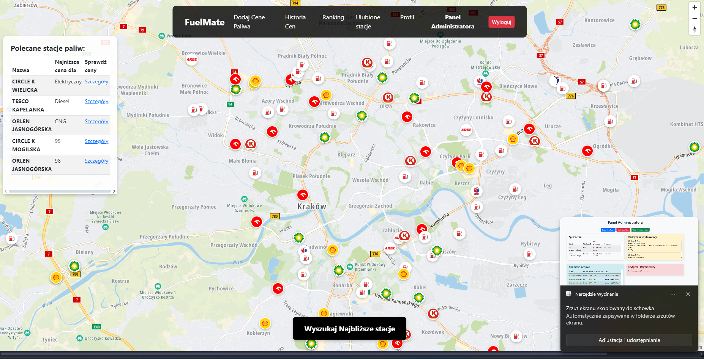
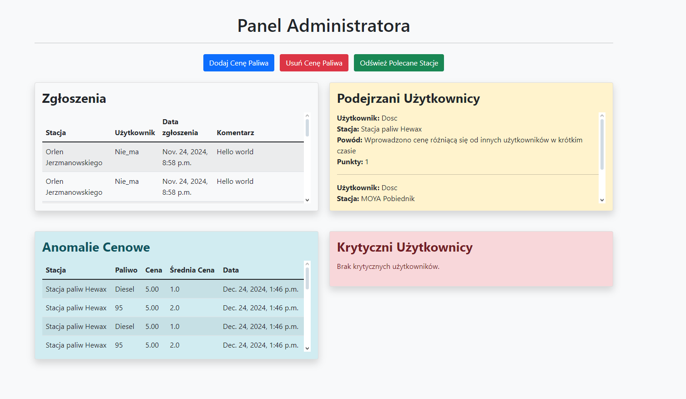
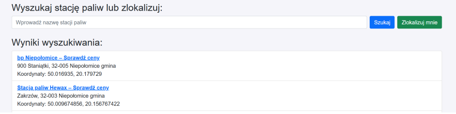
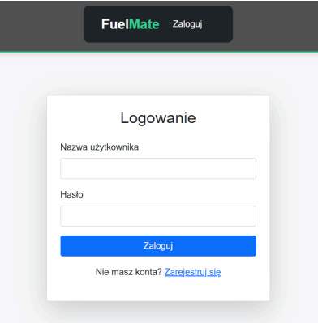

# ⛽ FuelMate

**FuelMate** is a Django-based web application that lets drivers …  

* find the cheapest nearby fuel,  
* update prices in real time,  
* rate and follow favourite stations,  
* and compete in a weekly leaderboard.  

Administrators gain an extra dashboard for anomaly detection, complaint handling and data management.

---

## 📸 Screenshots  

| Screen              | Preview                                               |
| ------------------- | ----------------------------------------------------- |
| Main Page           |                |
| Admin Panel         |            |
| Search Panel        |          |
| Login               |                        |

---

## ⚙️ Quick start
git clone https://github.com/<your-user>/FuelMate.git
cd FuelMate

python -m venv env
* Windows ➜ env\Scripts\activate
* macOS/Linux ➜ source env/bin/activate
pip install -r requirements.txt

cp .env.template .env          # add your GOOGLE_API_KEY inside
python manage.py migrate
python manage.py runserver
Browse to http://127.0.0.1:8000.

👥 Roles & features
Regular user
* One-click geolocation → list of stations within 2 km

* Add or update prices (min 10 min interval per user)

* Rate each station once (1 – 5 ★)

* View price history charts

* Manage favourite stations

* Join the weekly ranking

Administrator
* Full Django admin

* Custom dashboard

     ** complaints list

    ** automatic price-anomaly detection

     ** warning / critical-user view

* Station & user management

🔍 How “Find nearest” works

FuelMate calls Google Maps Geolocation API to retrieve the client’s coordinates.
A raw SQL (Haversine) query returns all stations inside a 2 km radius, ordered by distance.

🏅 Weekly ranking

A scheduled task sums user points from Monday 00:00 to Sunday 23:59.
Top 10 users are displayed with medal colours:

Rank	Colour
1	🥇 gold
2	🥈 silver
3	🥉 bronze

🗂 Project layout
FuelMate/
├─ accounts/          authentication & profiles
├─ add_prices/        price submission flow
├─ admin_panel/       anomaly dashboard
├─ price_history/     charts & logs
├─ station_details/   station view + rating
├─ static/            global CSS & JS
├─ templates/
└─ manage.py
